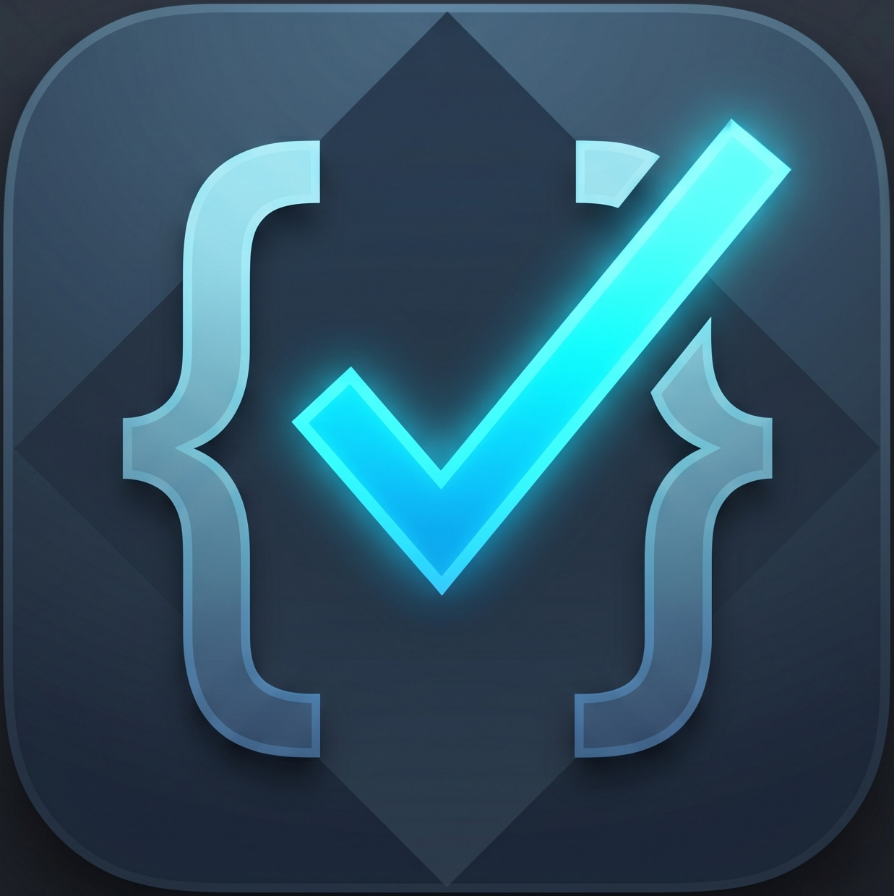

# SanityCheck: Local-First AI Interview Simulator



SanityCheck is a privacy-first, zero-dependency, open-source mock interview platform. It operates entirely on your local machine, requiring no remote cloud APIs, tracking metrics, or external data processing.

## 🚀 Core Architectural Pillars

- **Total Data Sovereignty**: Confidential resumes, job descriptions, and interview recordings never leave your computer.
- **Zero-Cost Iteration**: Run infinite mock interviews without third-party API token fees.
- **Conversational Low-Latency**: Achieves near real-time feedback loops using local LLMs.
- **"No-BS" Grading**: A specialized evaluation engine that rewards honesty and penalizes bluffing or hallucinations.

## ✨ Key Features

- **Voice Interface**: Hands-free interview experience using browser-native Speech-to-Text and Text-to-Speech.
- **Cross-Domain Versatility**: Built-in logic dynamically pivots between Software Engineering whiteboards, Medical/Clinical patient scenarios, and Business behavioral questions.
- **Global Multi-Language Support**: Support for English, Spanish, French, German, Mandarin, and Japanese interviews.
- **Smart Pipeline Generation**: Analyzes any Job Description to craft a customized 2-4 stage interview roadmap.
- **Split-Screen Workspace**: Transitions from conversational chat to a technical sandbox for whiteboard and scenario assessments.
- **Hardware-Adaptive Tiering**: Choose from LITE, STANDARD, or PRO tiers to match your machine's VRAM/RAM capabilities.
- **Dynamic Theming**: 5 high-fidelity visual styles including `Sleek Dark`, `Ocean Blue`, and `Royal Amethyst`.

## 🛠️ Prerequisites

1.  **Node.js**: Version 18 or higher.
2.  **Ollama**: Ensure [Ollama](https://ollama.com/) is installed and running (`ollama serve`).

## 📥 Installation & Setup

1.  **Clone the Repository**:
    ```bash
    git clone https://github.com/joshuabharper7/SanityCheck.git
    cd SanityCheck
    ```
2.  **Install Dependencies**:
    ```bash
    npm install
    ```
3.  **Launch the App**:
    - **Windows**: Double-click the `SanityCheck.exe` or `Start-SanityCheck.bat` in the root folder.
    - **Developer Mode**: Run `npm run dev` and navigate to `http://localhost:3333`.

## 🧠 Model Tiers

- **LITE** (< 8GB RAM): `llama3.2:3b` / `qwen2.5-coder:7b`
- **STANDARD** (8GB - 16GB RAM): `llama3.1:8b` / `qwen2.5-coder:14b`
- **PRO** (>= 16GB RAM): `llama3.1:8b` / `qwen3-coder:30b`

*Use the built-in **Onboarding Wizard** to pull these models automatically.*

## 📄 License

Open-source under the MIT License.
